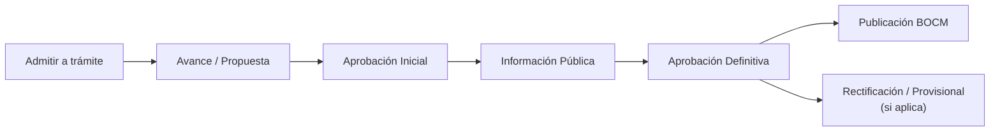
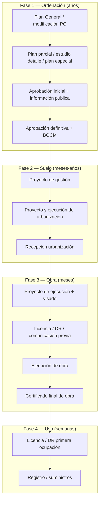
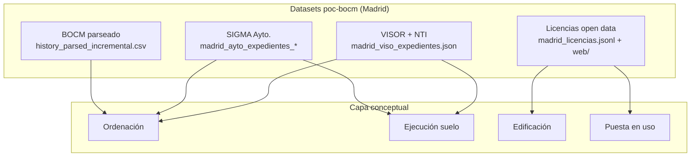

# Urbanismo y construcción en España — Marco conceptual y mapeo con datos Madrid (poc-bocm)

Documento de referencia interna para organizar la información de vivienda y urbanismo recopilada en el PoC. Resume el marco legal estatal, el ciclo de vida de un proyecto y cómo se relaciona con nuestros datasets, incluyendo **huecos conocidos** y prioridades de enriquecimiento.

**Última actualización:** 2026-05-16  
**Ámbito principal:** Madrid capital (complementario: Comunidad de Madrid vía BOCM)

---

## 1. Resumen ejecutivo

En España **no existe un único expediente “proyecto de vivienda”**. La actividad urbanística se articula en **cuatro líneas** que pueden solaparse en el tiempo pero tienen trámites, identificadores y fuentes distintas:

| Línea | Pregunta que responde | Autoridad típica |
|-------|----------------------|------------------|
| **Ordenación (planeamiento)** | ¿Qué se puede hacer en ese suelo? | Ayuntamiento + publicación (BOCM) |
| **Gestión / urbanización** | ¿Cómo se reparte y urbaniza el sector? | Ayuntamiento |
| **Edificación (licencias)** | ¿Qué obra concreta se autoriza en parcela/edificio? | Ayuntamiento (Distritos / Agencia Actividades) |
| **Puesta en uso** | ¿Es legal y habitable lo construido? | Ayuntamiento |

**Implicación para el PoC:** tenemos muchísima señal en **licencias** (~165k) y señal rica pero acotada en **planeamiento** (~4k expedientes SIGMA, ~3k fichas VISOR). El cruce entre ambas capas es **débil** (no comparten ID de expediente de forma sistemática).

---

## 2. Marco legal estatal (TRLU)

**Norma:** Real Decreto Legislativo 7/2015 — Texto Refundido de la Ley de Suelo y Rehabilitación Urbana ([BOE-A-2015-11723](https://www.boe.es/buscar/act.php?id=BOE-A-2015-11723)).

### 2.1 Dos familias de actuación (art. 7 TRLU)

**A) Actuaciones de transformación urbanística**

- **Urbanización**
  - *Nueva urbanización:* suelo rural → urbanizado (infraestructuras, parcelas edificables).
  - *Reforma / renovación* de urbanización existente.
- **Dotación:** más equipamientos sin reformar toda la urbanización del ámbito.

**B) Actuaciones edificatorias** (las más cercanas al “mercado de vivienda” puntual)

- Nueva edificación y sustitución.
- Rehabilitación edificatoria (mantenimiento, reforma según LOE).

La edificación **presupone** que el planeamiento vigente ya permite la actuación. Si no, antes hay que tramitar instrumentos de desarrollo o modificación del Plan General.

### 2.2 Clasificación del suelo (Plan General)

| Clase | Significado operativo |
|-------|----------------------|
| **Suelo urbano** | Urbanizado; edificación con licencia/DR salvo restricciones |
| **Suelo urbanizable programado** | Desarrollo previsto en programa del PG |
| **Suelo urbanizable no programado** | Reserva; limitaciones hasta programación |
| **Suelo no urbanizable** | Protección / uso rural muy restringido |

En Madrid capital el instrumento de referencia es el **PGOUM-97** y sus modificaciones (visible en cabeceras VISOR: `PGOUM-97 / PLANEAMIENTO DE DESARROLLO…`).

---

## 3. Instrumentos de planeamiento

Jerarquía habitual (estatal + desarrollo autonómico/municipal):

| Instrumento | Alcance | Ejemplo en nuestro BOCM parseado |
|-------------|---------|--------------------------------|
| **Plan General (PGOU / PGOUM)** | Municipio | Modificaciones del PG |
| **Plan parcial** | Sector | Sectores en municipios CM |
| **Estudio de detalle** | Precisión sobre PG | `bocm-20260504-82-estudio-detalle-madrid` |
| **Plan especial** | Casos concretos | `bocm-20260504-81-plan-especial-madrid` |
| **Proyecto de urbanización** | Ejecución material del sector | Anuncios BOCM “Proyecto urbanización” |
| **Proyecto de gestión** | Reparto cargas/beneficios, sistema de actuación | Menos visible en titulares BOCM |

### 3.1 Hitos del procedimiento de planeamiento



**Nota:** La aprobación definitiva **no autoriza obra**. Fija la **ordenación** (usos, edificabilidad, condicionantes). La obra requiere **licencia o declaración responsable**.

Fases observadas en SIGMA (índice `madrid_ayto_expedientes_index.json`, mayo 2026):

| Fase (`FAS_TX_DENOM`) | Expedientes |
|----------------------|-------------|
| Aprobación Definitiva | ~2.689 |
| *(sin fase)* | ~990 |
| Aprobación Inicial | ~166 |
| Información Pública | ~12 |
| Otras (Propuesta, Rectificación, Avance…) | ~109 |

---

## 4. Gestión y urbanización (entre planeamiento y licencia)

| Fase | Contenido |
|------|-----------|
| **Proyecto de gestión** | Sistema de actuación (compensación, cooperación…), reparto de cargas |
| **Proyecto de urbanización** | Viario, redes, espacios libres |
| **Ejecución y recepción** | Obras en calle; recepción municipal |

En Madrid, SIGMA expone capas separadas (dataset **300119**):

| Capa SIGMA | `source` en índice | Expedientes (aprox.) |
|------------|-------------------|----------------------|
| Planeamiento desarrollo (AD) | `tramitados_ad` | 2.979 |
| Gestión | `tramitados_gestion` | 495 |
| Urbanización | `tramitados_urbanizacion` | 495 |
| Información pública | `informacion_publica` | 7 |

Los visores usan URLs distintas: `expPlaneamiento.iam`, `expGestion.iam`, `expUrbanizacion.iam`.

---

## 5. Edificación: licencias y procedimientos

### 5.1 Procedimiento administrativo (cómo se autoriza)

Regulación municipal detallada en Madrid: **Ordenanza 6/2022** de Licencias y Declaraciones Responsables Urbanísticas ([sede.madrid.es](https://sede.madrid.es/sites/v/index.jsp?vgnextoid=d3cdd4b13e0d0810VgnVCM1000001d4a900aRCRD)).

| Procedimiento | Significado | Volumen en licencias Madrid (índice) |
|---------------|-------------|--------------------------------------|
| **Declaración responsable** | El técnico declara cumplimiento; control posterior | ~74.168 |
| **Procedimiento ordinario** (común / abreviado) | Licencia con instrucción y resolución | ~49.625 |
| **Comunicación previa** | Obra comunicada | ~19.837 |
| **Licencia urbanística** (genérico en dataset) | ~10.668 |
| **Licencia de funcionamiento / actividad** | Uso comercial, no vivienda | ~2.751+ |

### 5.2 Tipos de actuación edificatoria (qué se hace)

Top tipos en `output/madrid_licencias.jsonl` (relevantes vivienda):

| Tipo | Interpretación |
|------|----------------|
| DR / licencia **residencial** | Obra en vivienda |
| **OC transformación locales → viviendas** | Cambio uso comercial a vivienda (muy relevante en centro) |
| **Reestructuración puntual / parcial** | Reordenación sin obra mayor completa |
| **Obras nueva planta** | Edificación nueva |
| **Ampliación** | Más superficie / altura |
| **Consolidación / conservación** | Mantenimiento estructural o fachada |
| **Primera ocupación** (y DR de PO) | Fin de obra; legalización de uso |
| **Actividad / funcionamiento** | Local comercial / industrial |

### 5.3 Obra mayor vs menor (criterio general)

| | Obra mayor | Obra menor |
|---|------------|------------|
| **Proyecto técnico** | Proyecto básico + ejecución, visado colegio | Documentación reducida / memoria |
| **Alcance** | Estructura, fachada, distribución, cambio de uso relevante, nueva planta | Acondicionamiento, pequeñas reformas, divisiones sin afectar estructura |
| **Plazo resolución** | Hasta 3 meses (régimen general) | Más ágil |

---

## 6. Puesta en uso (primera ocupación)

Tras la obra:

1. **Certificado final de obra** (CFO) — dirección facultativa.
2. **Licencia / DR de primera ocupación** — acredita conformidad urbanística y habitabilidad.
3. **Altas** (suministros, registro) — dependen de LPO en la práctica.

En licencias Madrid aparece como `PRIMERA OCUPACIÓN Y FUNCIONAMIENTO`, `Declaración Responsable - Primera Ocupación`, etc.

---

## 7. Ciclo de vida unificado (esquema de referencia)



---

## 8. Mapeo con nuestros datos

### 8.1 Vista general de fuentes



### 8.2 Tabla de mapeo por capa conceptual

| Capa | Hitos / entidades | Fuente principal | Archivos / rutas | Campos clave |
|------|-------------------|------------------|------------------|--------------|
| **Ordenación** | AI, IP, AD, publicación BOCM | SIGMA + VISOR + BOCM | `output/madrid_ayto_expedientes_index.json`, `output/madrid_viso_expedientes.json`, `output/history_parsed_incremental.csv`, `web/public/data/madrid-sigma-*.geojson` | `EXP_TX_NUMERO`, `FAS_TX_DENOM`, `EXP_TX_DENOM`, `tramitacion[]`, `tipo_instrumento`, `estado_tramitacion`, `procedimiento_expediente` |
| **Gestión suelo** | Proyecto gestión, UE, compensación | SIGMA seguimiento | `tramitados_gestion` en índice; visor `expGestion.iam` | Prefijos expediente `711/…`, figuras `UE.*` en enlaces |
| **Urbanización** | Proyecto urbanización, ejecución | SIGMA + BOCM | `tramitados_urbanizacion`; BOCM `tipo_instrumento=Proyecto de Urbanización` | Prefijos `714/…`, `PU.*` en visor |
| **Edificación** | Solicitud, concesión/DR, tipos de obra | Open data licencias | `output/madrid_licencias.jsonl`, `web/public/data/madrid-licencias-YYYY.json` | `tipoExpediente`, `procedimiento`, `fechaAlta`, `fechaConcesion`, `uso`, `ndpEdificio`, `direccion` |
| **Puesta en uso** | LPO / DR PO | Licencias (parcial) | Tipos `PRIMERA OCUPACIÓN…`, `Declaración Responsable - Primera Ocupación` | Sin expediente de obra enlazado |
| **Documentación** | Informes, acuerdos, planos | NTI + PDFs BOCM | `ntiArbol` en viso; `pdfs_history/` | `rutaCarpetas`, `tipodocNti`, URLs `VISAE_WEBPUB` |

### 8.3 Identificadores y cruces

| Identificador | Dónde aparece | Cruce actual |
|---------------|---------------|--------------|
| **Expediente Ayto.** `135/AAAA/NNNNN` o `711/AAAA/NNNNN` | SIGMA, VISOR, BOCM (si el LLM lo extrae) | **BOCM ↔ SIGMA:** solo por número exacto (`madrid_ayto_match.py`). **261 enlaces** sobre 953 BOCM Madrid ciudad relevantes (**27,4%**). Sin fuzzy por denominación. |
| **Expediente grupo** (último tramo 5 dígitos) | Normalización en `web/lib/madrid-expediente.ts` | Usado en build-data y viso |
| **NDP edificio** | Licencias | **No enlazado** a SIGMA/VISOR |
| **Dirección / distrito / barrio** | Licencias, denominación SIGMA | Cruce manual/heurístico **no implementado** |
| **Geometría** | SIGMA polígonos (~997 con geom), licencias puntos (~152k) | BOCM puede tomar coords del polígono SIGMA si hay match |
| **Figura urbanística** (`PE.08.349`, `PU.18.359`…) | URLs visor en match BOCM | No persistida como campo propio en índice |

### 8.4 Scripts y artefactos del pipeline

| Script | Función |
|--------|---------|
| `sector_geometry/madrid_ayto_sync.py` | Descarga SIGMA, índice unificado, cruce BOCM |
| `sector_geometry/madrid_viso_fetch.py` | Tramitación + URLs NTI por expediente |
| `sector_geometry/madrid_viso_docs_download.py` | Descarga documentos NTI |
| `sector_geometry/madrid_licencias_download.py` | Volcado licencias datos.madrid.es |
| `web/scripts/build-madrid-licencias.mjs` | JSON/GeoJSON por año para la web |
| `web/scripts/build-data.mjs` | Fichas producto SIGMA + enlaces BOCM |

### 8.5 Cobertura numérica (snapshot 2026-05-16)

| Dataset | Volumen | Notas |
|---------|---------|-------|
| Licencias urbanísticas Madrid | **164.878** filas; **152.019** con coords | Dataset 300193; años 2015–2026 |
| Expedientes SIGMA (índice) | **3.976** (3.905 únicos) | IP(7) + AD(2979) + gestión(495) + urbanización(495) |
| Geometría SIGMA | **997** expedientes | Resto sin polígono en capa |
| Fichas VISOR | **2.975** / 2.982 objetivos | Tramitación en casi todas |
| Árbol NTI descargado en viso | **~191** expedientes | Mayoría sin árbol NTI en JSON |
| BOCM filas Madrid (provincia) | **~2.645** | Incluye municipios CM |
| BOCM Madrid **ciudad** relevantes | **953** | `madrid_ayto_bocm_match.json` |
| Match BOCM ciudad ↔ SIGMA | **261** (27,4%) | Solo cuando `procedimiento_expediente` parseable |
| BOCM sin match expediente | **692** | Muchos anuncios sin nº en texto parseado |

### 8.6 Tipos en UI / TypeScript

Definiciones en `web/lib/types.ts`:

- `SigmaExpediente`, `MadridSigmaDataset`, `SigmaFicha`
- `MadridLicenciaRow`, `MadridLicenciasIndex`

Exploradores: `MadridSigmaExplorer.tsx`, `MadridLicenciasExplorer.tsx`, `MadridBocmExplorer.tsx`.

---

## 9. Qué nos falta (huecos y prioridades)

### 9.1 Cruces entre capas

| Hueco | Impacto | Posible remedio |
|-------|---------|-----------------|
| **Licencias ↔ expediente planeamiento** | No podemos decir “esta licencia nace de este plan parcial” | Cruce espacial (licencia dentro de polígono SIGMA) + fuzzy dirección/denominación |
| **Licencias ↔ licencias** (misma obra) | Duplicados, modificaciones, fases | Agrupar por `ndpEdificio` + ventana temporal + tipo |
| **BOCM ↔ SIGMA** (73% sin match) | Pérdida de contexto en anuncios recientes | Mejorar extracción LLM de `procedimiento_expediente`; regex en PDF; match por `nombre_sector` / dirección |
| **BOCM licencias vs dataset licencias** | Dos fuentes de licencias sin unificar | Normalizar anuncios BOCM “Licencias” con open data por dirección/fecha |
| **Gestión/urbanización ↔ AD** | Mismo sector, distintos números (`135/` vs `711/` vs `714/`) | Tabla de relación por figura (`PE`, `UE`, `PU`) o por denominación SIGMA |

### 9.2 Campos de dominio ausentes

| Campo conceptual | Estado en nuestros datos |
|------------------|-------------------------|
| **Clasificación suelo** (urbano / urbanizable / NU) | No en SIGMA ni licencias; solo en textos PG/BOCM si parseamos |
| **Instrumento planeamiento normalizado** | BOCM tiene `tipo_instrumento` (LLM); SIGMA tiene `visorCabecera` libre |
| **Sistema de actuación** (compensación, cooperación…) | Solo en PDFs / NTI no descargados |
| **Superficie / edificabilidad / nº viviendas** | BOCM LLM a veces; no en licencias |
| **Estado de obra** (en curso, finalizada) | No; solo fechas alta/concesión licencia |
| **Promotor unificado** | `interesado` en licencias; `promotor_o_propietario` en BOCM; sin entidad resuelta |
| **Certificado final de obra / LPO enlazada** | Tipos PO en licencias; sin enlace a expediente de obra origen |
| **Figura urbanística** (`PE.xx`, `API.xx`) | En URL del visor; no como campo indexado |

### 9.3 Cobertura de fuentes

| Fuente | Gap |
|--------|-----|
| **VISOR** | Fetch masivo hecho; **NTI completo** solo en fracción (~191/2975 con árbol) |
| **SIGMA IP** | Solo 7 expedientes en capa pública vs muchos en tramitación |
| **Municipios CM** | BOCM provincia sí; **sin SIGMA** ni licencias unificadas fuera de Madrid ciudad |
| **Catastro / parcelas** | No integrado; clave para anclar geometrías |
| **Registro / notas simples** | No disponible |
| **Precios / comercialización** | Fuera del ámbito administrativo actual |

### 9.4 Modelo de datos propuesto (siguiente paso)

Entidades sugeridas para unificar la UI y los cruces:

```
ActuacionOrdenacion   # expediente SIGMA/BOCM, polígono, fases AI→AD
ActuacionSuelo        # gestión + urbanización (711/, 714/)
ActuacionEdificacion  # cada licencia/DR (ndp, dirección, fechas)
Inmueble              # ndp + dirección normalizada + geom
Hito                  # evento fechado (tipo, fuente, expediente_id)
```

Relaciones:

- Una **ordenación** → muchas **parcelas** (polígono).
- Una **parcela** → muchas **licencias** en el tiempo.
- Una **licencia de obra** puede existir **sin** expediente SIGMA reciente.

---

## 10. Referencias

| Recurso | URL / ubicación |
|---------|-----------------|
| TRLU (BOE) | https://www.boe.es/buscar/act.php?id=BOE-A-2015-11723 |
| Ordenanza licencias Madrid 6/2022 | https://sede.madrid.es/sites/v/index.jsp?vgnextoid=d3cdd4b13e0d0810VgnVCM1000001d4a900aRCRD |
| SIGMA expedientes (dataset 300119) | https://datos.madrid.es |
| Licencias urbanísticas (dataset 300193) | https://datos.madrid.es |
| Compendio PGOUM Madrid | https://transparencia.madrid.es/.../COMPENDIO_MPG_NNUU_24_09_2025.pdf |

---

## 11. Base de datos local (SQLite v2)

**BOCM ↔ SIGMA** (sin cambio): tabla `link_project_sigma` por número de expediente (`madrid_ayto_bocm_links.jsonl`).

**Licencias ↔ SIGMA** (nuevo): cruce espacial punto-en-polígono.

| Tabla / vista | Rol |
|---------------|-----|
| `sigma_catalog_expediente` | Catálogo SIGMA (ordenación + suelo) |
| `sigma_ambito_geom` | Polígonos SIGMA para cruces |
| `inmueble` | Ancla NDP edificio |
| `actuacion_edificacion` | Licencias urbanísticas |
| `link_licencia_sigma` | Enlace licencia ↔ expediente (`match_method=point_in_polygon`) |
| `actuacion_ordenacion` / `actuacion_suelo` | Vistas SQL sobre SIGMA |
| `hito` | Eventos (p. ej. desde `sigma_vis_tramite`) |

Comandos (desde `poc-bocm/`):

```bash
python3 db/migrate_sqlite.py              # BOCM + SIGMA + esquema v2
python3 db/ingest_madrid_ubicacion.py     # licencias + geometría + enlace espacial
# o en un paso:
python3 db/migrate_sqlite.py --ubicacion
```

Última corrida de referencia (2026-05-16): ~165k licencias, ~149k con coords, ~148k con ≥1 SIGMA en ámbito, ~866k filas en `link_licencia_sigma` (varias superposiciones de polígonos por licencia).

---

## 12. Changelog del documento

| Fecha | Cambio |
|-------|--------|
| 2026-05-16 | Creación inicial: marco TRLU, ciclo de vida, mapeo a datasets y huecos |
| 2026-05-16 | Sección 11: esquema SQLite v2 y enlace licencias↔SIGMA |
